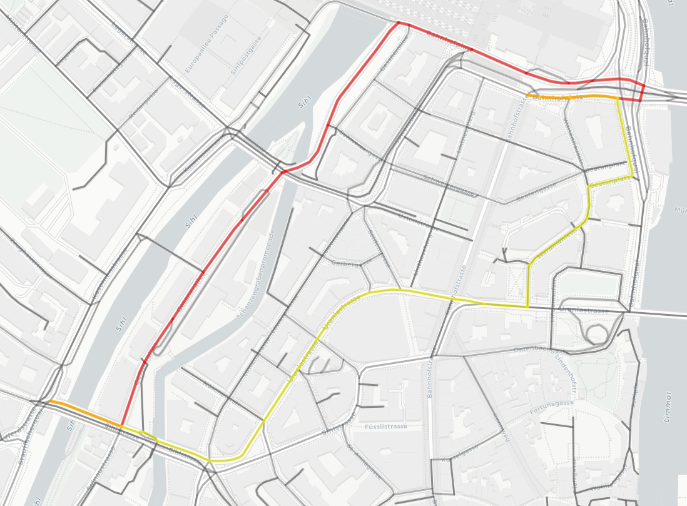
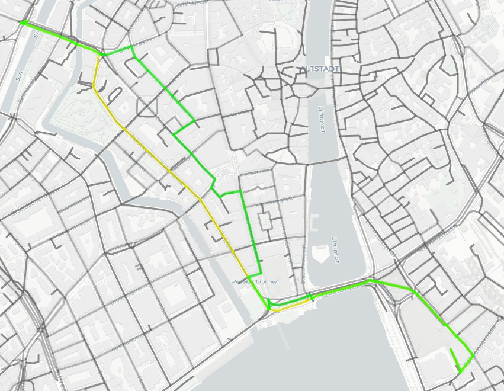

# Velosafe Routing

## How to install

1. Install Python
2. Install the required modules. They are **osmnx**, **scikit-learn**, **folium**
   Recommandation: Some of these packages are harder to install on Windows, for a more streamlined experience one might prefer to use Linux.

## How to use

`velosafe_backend_heuristics.py` compares the **baseline** algorithm (red) to our **heuristics** (yellow).  
`velosafe_backend_heuristics_user.py` compares our **heuristics** (yellow) to **heuristics and user ratings** combined (green).

Simply run the python scripts and inspect the generated `output.html` file.

The target location can easily be changed by modifying the attributes for `ox.graph_from_place`/`ox.graph_from_address`.
The start-/endpoint locations can be extended by modifying the `places`- dictionary.

To further optimise the algorithm, the notebook `VeloSafe_GraphDataAnalysis.ipynb` might help in getting an overview of the available attributes.

## Algorithm details

**Heuristics**:
 - The maximum road speed gets clamped to [30, 80] and linearly interpolated to a weighting [0.5, 1.5]
 - Based on the road type, ways are weighted (again in [0.5, 1.5]):
   - cycleway: 0.5
   - residential: 0.6
   - tertiary: 0.9
   - service: 1.2
   - primary: 1.5
   - trunk_link: 1.5
   - default: 1.0

&nbsp;&nbsp;&nbsp;&nbsp;$\Longrightarrow$ Average both of these weights to obtain a **heuristic weight**.

**User ratings**:
 - User ratings are also represented as a weight in [0.5, 1.5]. Currently, they are randomly generated. In the future, they will be fetched from a database. This gives a **user weight**.

$\Longrightarrow$ Taking the weighted average of heuristic weight and user weight gives the **final weight** which will be used to scale the optimisation parameter of the routing algorithm.

## Examples (click on them for an interactive view)

   

      
      

         
Baseline

         
Heuristics

      

      
   

   

      
      

         
Heuristics

         
Heuristics + User

      

      
   

