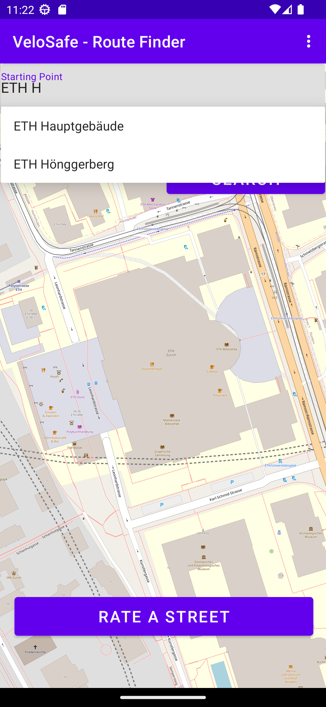
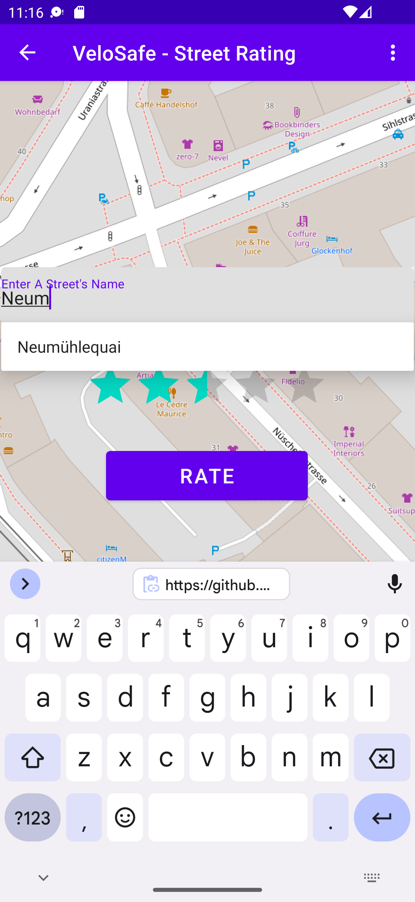
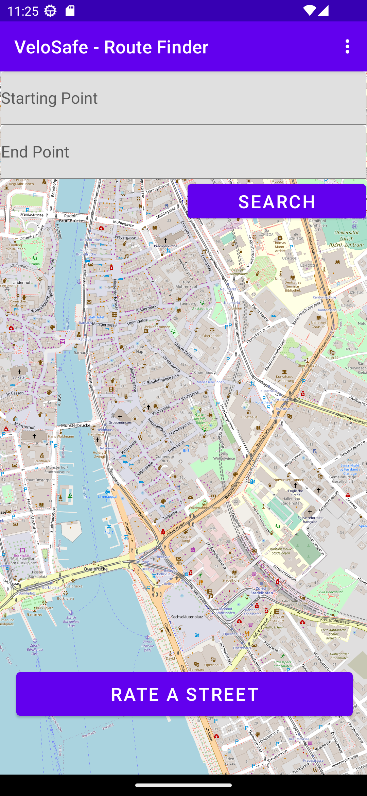

# Velosafe User Interface
## How to install
At the moment, VeloSafe is only available for Android OS. For editing you will have to download the github repository and open the frontend folder in Android Studio.

## How to use
The application currently has two fragments with a working map integrated. The first fragment takes two search bar inputs and saves their values. The second fragment takes a search bar input and a five star rating input and saves their values. These can be used to communicate with the backend, although this communication has not been implemented by us yet.

## User Interface

&nbsp;&nbsp;
